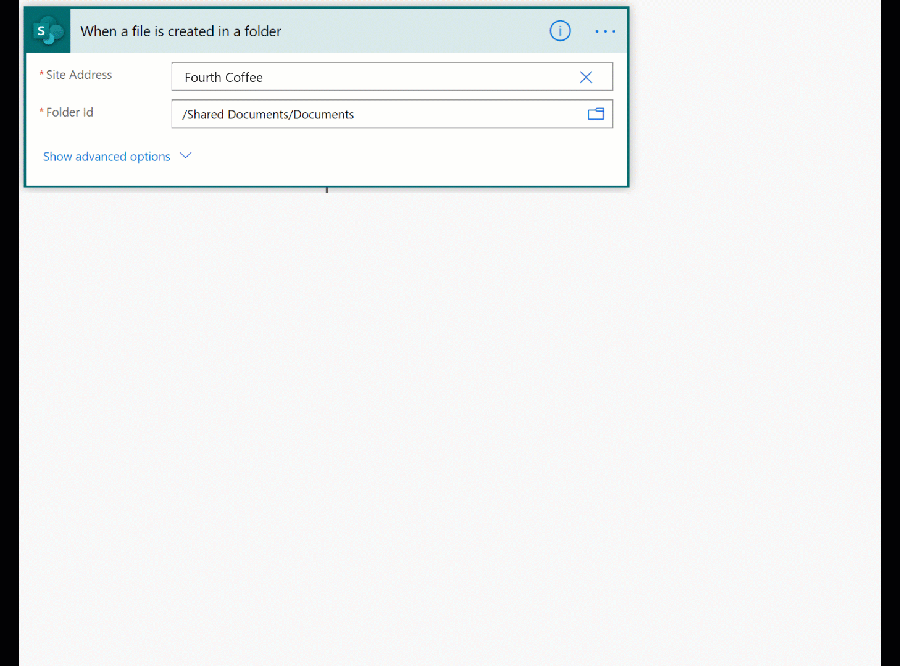

# Common issues and resolutions for AI Builder

Here are some issues that have been seen in AI Builder. Where applicable, workarounds are provided.

## AI Builder is not set up correctly in your environment

AI Builder might not work in some environments created before the release of AI Builder. To work around this issue, [create a new environment](https://docs.microsoft.com/power-platform/admin/create-environment). If you need to use a particular environment, [contact support](https://docs.microsoft.com/power-platform/admin/get-help-support) for more options.

## AI Builder gets errors trying to read data from your Common Data Service entity

See the data preparation section for your AI model type. Make sure your Common Data Service environment is configured correctly so that your model can access it.

## AI Builder business card reader doesn't work for some users

Make sure business card reader component users have access to Common Data Service, or to the AI Builder model entity configured in the business card reader component.

## When I scan images using AI Builder components in Power Apps, the output image rotation is wrong

This issue can occur with the Google Chrome browser due to the way this browser handles image-orientation. Some images in Power Apps may be rotated differently than you expect when using Chrome. To work around this issue, try a different browser.

## Training document is not displayed on form processing model details page

When you create a form processing model, a preview of one of the training documents appears on the model’s details page after training completes.

The training document may not appear if:

* You don’t have permissions to view training documents.
* You are not the owner of the model. 
* You imported the model from another environment. When you import a form processing model from another environment, the original training data is not imported with it, and thus the document preview can’t be displayed.  

## Too Many Requests error in Power Automate

If you perform too many executions in a short timeframe on a given model you may face an error: _429 – TooManyRequests_.

If such error happens, decrease the concurrency level of your flow. For example, if your flow is triggered by the action “When a file is created in a folder” when using the SharePoint trigger, you can reduce the degree of parallelism in the action settings.

   > [!div class="mx-imgBorder"]
   > 
