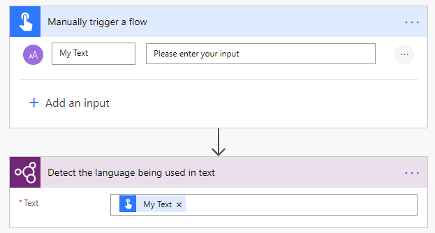
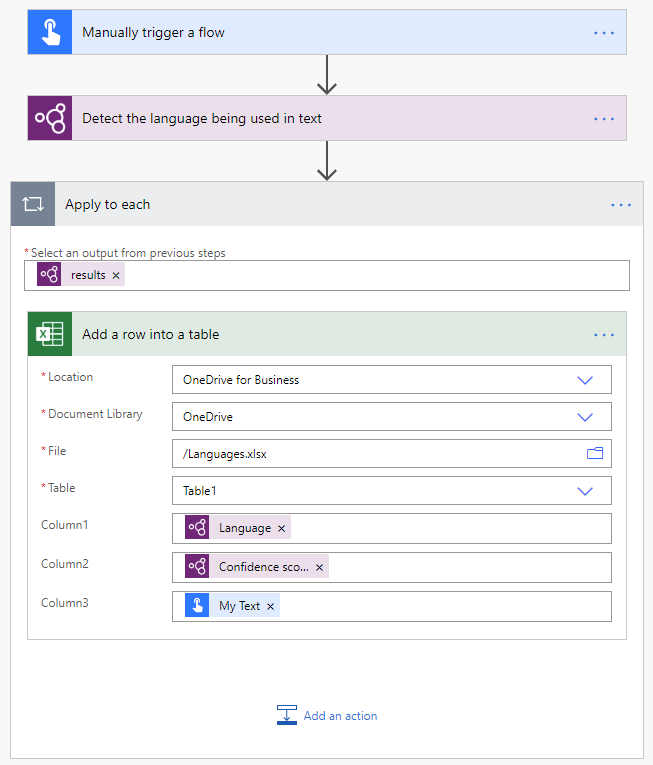

# Use the language detection prebuilt model in Power Automate

> [!IMPORTANT]
 > To use AI Builder models in Power Automate, you have to create the flow inside a solution. The steps below won't work if you don't follow these instructions first: [Create a flow in a solution](/flow/create-flow-solution).

1. Sign in to [Power Automate](https://flow.microsoft.com/), select the **My flows** tab, and then select **New > +Instant-from blank**.
1. Name your flow, select **Manually trigger a flow** under **Choose how to trigger this flow**, and then select **Create**.
1. Expand **Manually trigger a flow**, select **+Add an input**, select **Text** as the input type, and set as input title **My Text**.
1. Select **+ New step**, search for the term **AI Builder**, and then select **Detect the language being used in text** in the list of actions.
1. Specify the **My Text** field from the trigger in the **Text** input for your flow:

    > [!div class="mx-imgBorder"]
    > 

1. In the successive actions, you can use any fields extracted by the AI Builder model. For example, you can add lines to an Excel file using **Language** and **Confidence score**:

    > [!div class="mx-imgBorder"]
    > 

Congratulations! You've created a flow that uses a language detection model. Select **Save** on the top right and then select **Test** to try out your flow.

### Related topic

[Language detection overview](prebuilt-language-detection.md)
